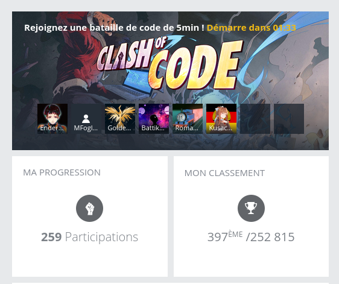

<center>
<i style="color: grey;">This page is a work in progress. I want to keep adding stuff I already know when I think of using it and new stuff when I discover it.</i>
</center>
<br/>

I love to play on [codingame](https://www.codingame.com) it's a great way to keep your algorithmic skills sharp while working on playful problems. One of my favorite game on this site is the [Clash of Code](https://www.codingame.com/multiplayer/clashofcode): a short competition against up to 8 players lasting at most 15 minutes.

There are several types of clashes (fastest to get the right solution, reverse engineering and shortest code) and recently the shortest code became one of my favorite. Since I start to have a decent ranking I compiled some tricks I use in javascript to shorten my code. Some save several bytes and other only save a few but learning how to combine them and when to use them can lead a long way.


<center>
<i>Rank: 432/252.316 - At one point I even got under 300 but forgot to screenshot it 🤦</i>
</center>


### Type conversions
#### String to Number

When an input is expected to be a number examples usually use the following code:

```javascript
n = parseInt(readline());
```

This is 10 characters just to parse a number from a string. Using the unary operator `+` on a string will cast it to a number. Example:

```javascript
let s='12';
let n=+s;

typeof n; // 'number'

let t=+s[0]+s[1]; // t=3
```

Note that if you need to add a variable which is a number to a string representing a number you will need to use the string first or add a whitespace before the `+` operator:

```javascript
let s='1';
let n=1;

n+s;    // string: '11'
n+ +s;  // number: 2

+s+n    // number: 2
```

### Loops

#### For < while

`for` loops are most of the time the most byte efficient way to write loops.

```javascript
while(1)
for(;;)
```

#### Declarations in `for` loop first statement

In javascript you can combine some statements with `,` and this can be used to put a lot of things. This is a simple example but it can get much more complex and powerful:

```javascript
for(i=0,a=1;i<10;i++)
```

#### `for (... of ...)`

When you need to iterate on a list the `for (iterator of list)` syntax is much shorter than `for (i=0; i<list.length; i++)`, but also most of the time is beats functions like `.forEach` or `.map` because you don't need the arrow function and the iterator is available:

```javascript
l.map(Number)    // Good
l.map(c=>+c)     // Better
for(c of l)t+=+c // Top
```

### Variables declaration and initialization

#### Get rid of explicit declaration statements

Code golf solutions are often very short and not complex enough to require switching between different scopes. So most of the time you can loose the `let`, `const` and others `var` from your code.

You should always have in mind the implications of not implicit scopes but that saves you a lot of characters.

```javascript
// 58 bytes
let n=10;
for(let i=0; i<n; i++) {
    console.log(i);
}

// 37 bytes
n=10
for(i=0;i<n;i++)console.log(i)
```

#### Chained declarations

You've probably tried to do this in a project and had eslint yelling at you for doing that, but in codegolf that saves bytes:

```javascript
a=b=1
a;  // 1
b;  // 1
```

### Math

#### Replacing Math built-ins with bitwise operations

In math challenges using bitwise operations are often very powerful. This is not something every developer is used to but it's worth knowing them

```javascript
Math.floor(n)
0|n
n|0

Math.round(n)
n+.5|0

Math.ceil(n)
n%1?-~n:n

Math.abs(n)
n<0?-n:n

Math.min(x,y)
x<y?x:y

Math.max(x,y)
y<x?x:y
```

#### Get rid of leading zeros

```javascript
0.5 === .5 // true
```

### Codingame particularities

These tips are only useful on the codingame website.

#### Shorten `readline` calls

Codingame provides a `readline()` function to get the inputs of a problem. This function will read one line of standard input and return it as a string without the new line character.

If you need to use `readline()` more than one it will be cheaper to store it in a variable first:

```javascript
// 27 bytes
n=readline()
m=readline()

// 24 bytes
r=readline
n=r()
m=r()
```

This is only 3 characters saved but the more calls to `readline()` you need to write the more characters you save.

#### Execute code in the `readline` arguments

You can use javascript scope smartly to reduce the number of bytes needed to get the inputs. To do so keep in mind that if you pass a variable assignation as the argument of a function the variable is still available in your current scope.

For example let's say you need to read two strings `n` and `m` and to init a counter `i` to zero:
```javascript
// 28 bytes
r=readline
n=r()
m=r()
i=0
```

This can be shortened like this:

```javascript
// 26 bytes
r=readline
m=r(n=r(i=0))
```

⚠ The order of calls made to `r()` is important here: The first call made to the function should be the most nested.

#### Shorten the strings passed as arguments

I'm not completely sure how this trick works because I can't reproduce it in a browser or in node, but in codingame if you need to pass a string as an argument you can avoid the whole `('string')` syntax with a pair of back ticks. This can be useful to split a string or join an array:

```javascript
'ab cd ef'.split(' ')
'ab cd ef'.split` `

[1, 2, 3].join('\r')
[1, 2, 3].join`\r`

```

#### Replace `console.log` by `print`

To pass your result to codingame validators you need to write it to the standard output. In regular javascript this is done with `console.log` however codingame's environment supports the deprecated `print` which works exactly the same:

```javascript
console.log('valid')
print('valid')
```

<!-- vim: set spell: -->
